# Claude Code Configuration

This repository is designed to be cloned directly as `~/.claude/` - the Claude Code configuration directory.

## Fresh Install

```bash
# Clone as ~/.claude
git clone https://github.com/sloanahrens/slash-commands.git ~/.claude

# Configure
cd ~/.claude
cp config.yaml.example config.yaml
# Edit config.yaml with your workspace path and repos

# Install devbot CLI
make -C devbot install
```

Or after cloning, run `/setup-workspace` in Claude Code.

---

## Workflow Overview

The command system provides a complete feature development workflow with Linear integration and multi-session tracking via Beads.


### Command Descriptions

| Command | Purpose |
|---------|---------|
| `/prime-context` | Load context: fetch Linear issues, match to plans, show ready beads, highlight gaps |
| `/super-plan` | Design phase: brainstorm, create design doc and implementation plan (accepts Linear issue ID) |
| `/plan-to-beads` | Convert plan tasks to trackable Beads issues with dependencies |
| `/execute-plan` | Execute tasks with TDD, track via Beads, handles context compaction |
| `/capture-session` | Wrap up: sync beads, log decisions, post progress to Linear |

---

## Data Linkage: Linear → Plans → Beads

The system maintains traceability between Linear issues, plan documents, and Beads for progress tracking.

```mermaid
flowchart LR
    L["📋 Linear Issue<br/>XYZ-15"] -->|"/super-plan"| P["📄 Plan File<br/>*-plan.md"]
    P -->|"/plan-to-beads"| F["🎯 Feature Bead"]
    F --- T1["Task 1"] & T2["Task 2"] & T3["Task 3"]

    style L fill:#e3f2fd
    style P fill:#fff8e1
    style F fill:#e8f5e9
    style T1 fill:#e8f5e9
    style T2 fill:#e8f5e9
    style T3 fill:#e8f5e9
```



### Tracing Direction

| Command | Traces |
|---------|--------|
| `/prime-context` | Linear → Plan (keyword/URL match), Plan → Beads (filename in description) |
| `/capture-session` | Beads → Plan (parse description), Plan → Linear (search for issue ID) |

---

## Quick Reference

**New feature from Linear issue:**
```bash
/prime-context myrepo          # See gaps
/super-plan myrepo XYZ-15      # Design from issue
/plan-to-beads myrepo          # Create tracking
/execute-plan myrepo           # Build it
/capture-session myrepo        # Wrap up, update Linear
```

**Resume existing work:**
```bash
/prime-context myrepo          # See ready beads
/execute-plan myrepo           # Continue
/capture-session myrepo        # Wrap up
```

---

## Configuration

Edit `config.yaml`:

```yaml
workspace: ~/code/my-workspace
repos:
  - name: my-project
    group: apps
    language: typescript
    work_dir: src                              # Optional subdirectory
    linear_projects: ["Project A", "Project B"] # Linear integration
    plan_paths: ["docs/plans", "~/docs/plans"]  # Where to find plans
```

### Linear Integration Fields

| Field | Purpose |
|-------|---------|
| `linear_projects` | Array of Linear project names to fetch issues from |
| `plan_paths` | Directories to search for plan documents (default: `docs/plans`) |

---

## Structure

```
~/.claude/                   # This repo
├── CLAUDE.md               # Global instructions
├── settings.json           # Permissions + plugins
├── config.yaml             # Your workspace config (gitignored)
├── hookify.*.local.md      # Hookify rules
├── commands/               # Slash commands
├── devbot/                 # CLI tool
├── hooks/                  # Session hooks
│
│ # Runtime (gitignored):
├── notes/                  # Session notes
├── history.jsonl
├── plugins/
├── cache/
└── ...
```

## What's Tracked vs Gitignored

**Tracked (travels with repo):**
- `CLAUDE.md` - Global Claude instructions
- `settings.json` - Permissions and plugins
- `hookify.*.local.md` - Hookify rules
- `commands/` - Slash commands
- `devbot/` - CLI tool source
- `hooks/` - Session hooks
- `config.yaml.example` - Config template

**Gitignored (local/runtime):**
- `config.yaml` - Your workspace paths
- `notes/` - Session notes
- `history.jsonl` - Conversation history
- `plugins/` - Downloaded plugins
- `cache/`, `debug/`, `todos/`, etc. - Runtime files

---

## All Commands

| Command | Description |
|---------|-------------|
| `/prime-context <repo>` | Load context from previous sessions |
| `/super-plan <repo> [topic]` | Brainstorm → design → implementation plan |
| `/plan-to-beads <repo>` | Convert plan to Beads issues |
| `/execute-plan <repo>` | Beads-aware task execution |
| `/capture-session <repo>` | End session: sync beads, log decisions |
| `/run-tests <repo>` | Lint, type-check, build, test |
| `/yes-commit <repo>` | Draft and commit changes |
| `/create-pr <repo>` | Create pull request |
| `/find-tasks <repo>` | Find high-priority tasks |
| `/setup-workspace` | Initial setup |

---

## devbot CLI

Fast parallel operations across repos:

```bash
devbot status              # Git status across all repos
devbot check <repo>        # lint, typecheck, build, test
devbot exec <repo> <cmd>   # Run command in repo directory
devbot path <repo>         # Get full path to repo
```

See [devbot/README.md](devbot/README.md) for full documentation.

---

## Migrating from Existing ~/.claude

If you have an existing ~/.claude with symlinks to this repo:

```bash
# 1. Save your config.yaml (it's gitignored)
cp ~/.claude/config.yaml ~/config.yaml.backup

# 2. Remove symlinks
rm ~/.claude/commands/*.md
rm ~/.claude/hookify.*.local.md
rm ~/.claude/CLAUDE.md ~/.claude/settings.json ~/.claude/config.yaml

# 3. Initialize git and pull
cd ~/.claude
git init
git remote add origin https://github.com/sloanahrens/slash-commands.git
git fetch origin
git reset --hard origin/master
git branch --set-upstream-to=origin/master master

# 4. Restore config
cp ~/config.yaml.backup ~/.claude/config.yaml

# 5. Rebuild devbot
make -C devbot install
```

## Syncing Changes

Since ~/.claude is a git repo:

```bash
cd ~/.claude
git pull                    # Get latest changes
git add -A && git commit    # Commit your changes
git push                    # Push to origin
```

## Updating devbot

After pulling changes that modify devbot:

```bash
make -C ~/.claude/devbot install
```

## Requirements

- [Claude Code](https://claude.ai/code) CLI
- Git
- Go 1.23+ (for devbot)
